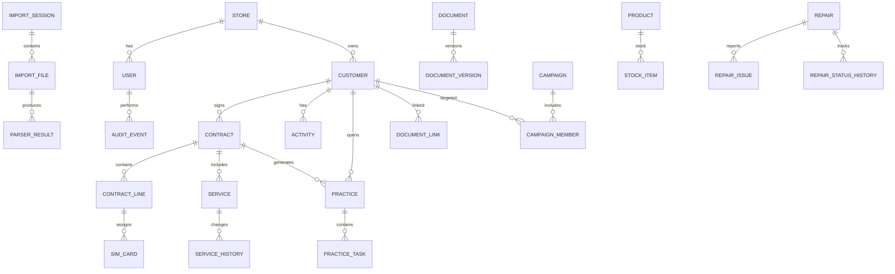

# ERD concettuale

```mermaid
erDiagram
    STORE ||--o{ USER : has
    STORE ||--o{ CUSTOMER : owns
    CUSTOMER ||--o{ CONTRACT : signs
    CUSTOMER ||--o{ ACTIVITY : has
    CUSTOMER ||--o{ PRACTICE : opens
    CUSTOMER ||--o{ DOCUMENT_LINK : linked
    CONTRACT ||--o{ CONTRACT_LINE : contains
    CONTRACT ||--o{ SERVICE : includes
    CONTRACT ||--o{ PRACTICE : generates
    CONTRACT_LINE ||--o{ SIM_CARD : assigns
    SERVICE ||--o{ SERVICE_HISTORY : changes
    PRACTICE ||--o{ PRACTICE_TASK : contains
    DOCUMENT ||--o{ DOCUMENT_VERSION : versions
    IMPORT_SESSION ||--o{ IMPORT_FILE : contains
    IMPORT_FILE ||--o{ PARSER_RESULT : produces
    CAMPAIGN ||--o{ CAMPAIGN_MEMBER : includes
    CUSTOMER ||--o{ CAMPAIGN_MEMBER : targeted
    PRODUCT ||--o{ STOCK_ITEM : stock
    REPAIR ||--o{ REPAIR_ISSUE : reports
    REPAIR ||--o{ REPAIR_STATUS_HISTORY : tracks
    USER ||--o{ AUDIT_EVENT : performs
```
